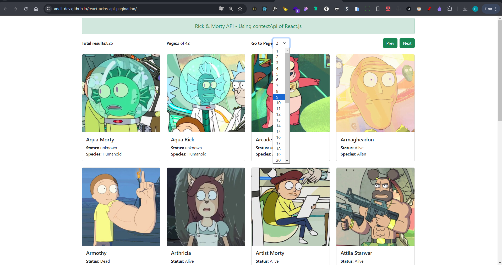

# Proyect with React.js - Axios - Bootstrap - Vite.js

## ¡Welcome! 👋

- Here you can see the final result -> [https://anell-dev.github.io/react-axios-api-pagination/](https://anell-dev.github.io/react-axios-api-pagination/)

**Project Description**

Website where you can see all the characters from the animated series Rick and Morty.

### Built with

- `React.js`
- `BootStrap`
- `Axios`
- `Vite.js`

### It applies concepts like

- `fetch`
- `Async / Await`
- `props`
- `useContext`
- `useEffect`
- `useState`

## Features

- **Api Request:** Request and consumption to the https://rickandmortyapi.com/ api
- **Character:** See the most relevant information about the character and his image
- **Pagination:** Forward, back or choose the page

### ScreenShot
